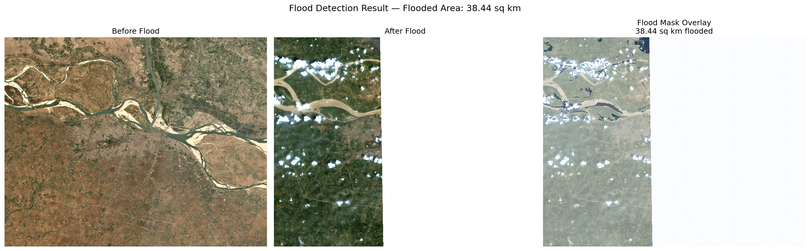

#Bihar Flood Mapper

Detects flood inundation extent from Sentinel-2 satellite imagery using a U-Net model.
Built to map the 2023 Bihar floods around Patna.

Live demo: https://bihar-flood-mapper.streamlit.app

##Overview

The idea is simple — compare a before and after satellite image of the same area,
and let a model figure out what changed. In this case, what changed is water.

The pipeline goes from raw GEE data export all the way to a web interface where
you can upload any two Sentinel-2 images and get a flood map back.

Full resolution inference detects 38.44 sq km  of inundation.
The live demo runs on subsampled imagery (25.09 sq km) due to free-tier memory constraints.

#How it works

1. Pull before/after Sentinel-2 image pairs from Google Earth Engine
2. Use NDWI thresholding to generate flood labels (ground truth)
3. Slice the full image into 256×256 patches — 1386 total
4. Train a U-Net (ResNet34 backbone, ImageNet pretrained) on 1108 patches
5. Validate on 278 held-out patches
6. Run sliding window inference on the full image
7. Output a flood mask with area in sq km

#Stack

- Google Earth Engine — data collection
- PyTorch + segmentation-models-pytorch — model training
- Streamlit — web interface
- Hugging Face — model hosting

#Results

| Metric | Value |
|---|---|
| Validation IoU | 0.6477 |
| Flooded area detected (full res) | 38.44 sq km |
| Flooded area detected (web demo) | ~25 sq km |
| Image resolution | 10m/pixel |

#Model

https://huggingface.co/krsnawrx/bihar-flood-mapper

#Known limitations

Cloud cover during monsoon season causes false positives in the flood mask.
The model is trained on a single region and may need fine-tuning for other geographies.